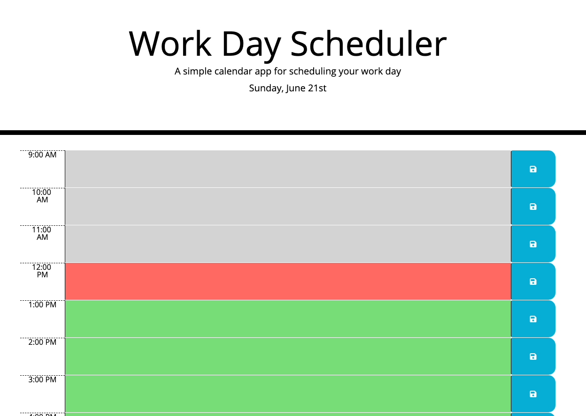

# Work Day Scheduler
This is a tool used to help people with a busy work schedule manage their time. Users are able to add tasks and see where their schedule is for the day. The tasks will be saved, so they will be able to return it later in the day. 

# Link to Deployed Application
[Work Day Scheduler](https://layc41.github.io/work-day-scheduler/)

# Screen Shots

